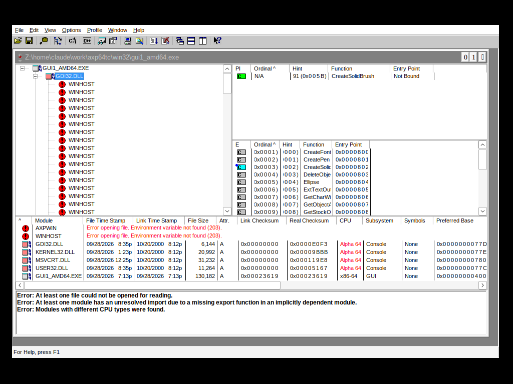

# DEC Alpha MFC42.dll reverse engineering

`MFC42.DLL` for Windows **AXP64** (64-bit DEC Alpha) does not exist any more,
and neither Wine nor ReactOS implements MFC. Without it, no real MFC
application from that era can be brought back.

This repository is a reimplementation — written in C, compiled to DEC Alpha
code — plus the analysis that made it possible: the ordinal map, the vtable
slot numbers, the structure offsets, and the tools used to recover them.



*Microsoft's Dependency Walker 2.0, built for Windows AXP64, running as DEC
Alpha code against this MFC42. It is analysing an amd64 binary, and it says
so itself: "Modules with different CPU types were found", `Alpha 64` against
`x86-64` in the CPU column.*

## The problem: ordinals, not names

`MFC42.DLL` exports almost everything by **ordinal alone** — there are no
names in the export table to match against. An application's import table is
a list of numbers. So the first task is to recover, for each of the 433
ordinals Dependency Walker imports, which MFC function it is.

### Method

The AXP64 export list is an **order-preserving subsequence** of the x86
`MFC42.DLL` export list — same sources, the x86 build being a superset. That
gives monotonicity: two known ordinals bound everything between them, and
when the two gaps have the same width the mapping inside is forced to be one
to one.

Anchors come from three places:

1. **Runtime proof.** Run the application under the translator with every
   unimplemented ordinal replaced by a tracing stub that reports its
   arguments. `#1549` arrives as `(this, 0x96, 26, 0, 0xFF00FF)` — a
   resource id, a width, a grow count and magenta: `CImageList::Create`.
   `#3331` arrives with mask 7, an image index and a heap pointer as
   `lParam`: `CListCtrl::InsertItem`.
2. **Vtable matching** against the x86 build and its public symbols
   (`tools/vtdump.py`).
3. **Monotonic bracketing** between anchors (`tools/brack.py`).

`docs/mfc42_ordinals.txt` records the result and how certain each entry is:
`RUNTIME` (proved by execution), `EXACT` (the two lists agree locally), or
`WINDOW n` (narrowed to n candidates).

## Findings worth writing down

**Indirect calls go through `v0`, not `pv`.** Microsoft's Alpha compiler
loads the target into `v0` and calls through it, where the SysV convention
used by GCC expects `pv`/`t12`. Counted across `depends.exe`: 1,222 of 1,321
indirect call sites use `$0`, **none** use `$27`, and at 1,320 of them `$27`
is not written anywhere in the preceding six instructions. A GCC-compiled
callee reached through a vtable therefore needs a thunk that sets `pv`
before jumping — `make_pv_thunk()`.

The exception, and the reason the import path works without help, is that
Microsoft's *import stub* ends `ldq $27,(IAT) ; jmp $31,($27)`, which leaves
the callee's address in `pv` and so satisfies the SysV contract by accident.
`depends.exe` reaches this DLL only that way, so `make_pv_thunk()` is
defensive for this particular application rather than load-bearing; the
measurement and a controlled experiment that does break are in
[ABI.md](https://github.com/ytrezq/dec-alpha-cross-binutils/blob/main/ABI.md).

**`_Ots*` helpers cannot be written in C.** The compiler assumes they
preserve every register it did not pass an argument in:

```
    mov  a0,t0            ; keep the string in t0
    bsr  ra,_Otsstrlen
    addq t0,v0,a0         ; t0 still live afterwards
```

GCC is free to clobber `t0`. These have to be native code that writes `v0`
and nothing else.

**Vtable slots** (read from the x86 build, whose layout the AXP64 build
shares — same sources, single inheritance):

| slot | |
|---|---|
| 12 | `GetMessageMap` |
| 25 | `PreCreateWindow` |
| 44 | `OnChildNotify` |
| 57 | `OnCreateClient` |
| 58 | `OnInitialUpdate` |
| 68 | `CListView::DrawItem` |

`DrawItem` is the interesting one. `CListView` declares it itself, so it
lands at the **end** of the class vtable rather than anywhere in `CWnd`'s
range. Searching for it by name is misleading: its default body is empty and
the linker folds it together with sixty other empty virtuals, so the address
appears at several slots at once. It has to be located in a class where the
implementation is real — `CCheckListBox`, `CFontComboBox` and
`CBitmapButton` all agree on the slot.

**Structure offsets**, measured rather than assumed:

| | offset |
|---|---|
| `CWnd::m_hWnd` | 64 (112 call sites load a `HWND` from `+64`) |
| `CView::m_pDocument` | 128 |
| `CDocument::m_strTitle` | 64 |
| `CDocument::m_strPathName` | 72 |
| `CImageList::m_hImageList` | 8 |

**Message maps.** `AFX_MSGMAP_ENTRY` is 32 bytes on this ABI, and the first
field of `AFX_MSGMAP` is a **function** returning the base map, not a pointer
to it. Reflected notifications use base `0xBC00`; the map stores `nCode`
truncated to 16 bits while the runtime notification arrives sign-extended,
so the comparison has to be on the low half.

**Owner-draw is the whole ball game.** Dependency Walker creates its lists
with `LVS_OWNERDRAWFIXED` and paints every row itself — the module names,
the ordinals and the red error text all come out of its own `DrawItem`. It
declares no `WM_DRAWITEM` handler anywhere in its message maps, because MFC
is supposed to turn the notification into a virtual call: parent →
`CWnd::OnDrawItem` → the control's virtual `OnChildNotify` →
`CListView::OnChildNotify` → the virtual `DrawItem`. Three MFC entry points,
none of which can be stubbed if anything is to appear on screen.

## Layout

| | |
|---|---|
| `mfc42.c` | the reimplementation |
| `genmfc.py` | generates the ordinal map and a tracing stub for every ordinal not yet implemented |
| `mfc42.ords` | ordinal → symbol, consumed by the linker |
| `mfc42.datamaps` | ordinals that must be exported as **data** (base message maps the application chains into) |
| `mfc42.classes` | the `CRuntimeClass` objects MFC itself owns |
| `tools/vtdump.py` | dump any MFC class vtable from the x86 build and its PDB |
| `tools/brack.py` | bracket an unknown AXP64 ordinal against the x86 export list |
| `docs/mfc42_ordinals.txt` | the ordinal map, with a confidence level per entry |
| `docs/ord2name_x86.json` | the x86 ordinal → mangled name table the analysis is anchored on |

## Status

42 ordinals implemented out of the 433 Dependency Walker imports — enough
for it to start, build its frame, toolbar, menus and splitters, run its own
dependency scan, and draw every pane: module tree, imports, exports, the
full module list with timestamps, checksums and CPU type, the error log and
the status bar.

The rest are tracing stubs, which is deliberate: an application that reaches
an unimplemented ordinal reports it and keeps running, so the next thing it
needs is always visible.

## Building it

`mfc42.c` is compiled to Alpha code by the cross toolchain and loaded by the
runtime:

* **[dec-alpha-cross-binutils](https://github.com/ytrezq/dec-alpha-cross-binutils)**
* **[test-windows-dec-alpha-builds](https://github.com/ytrezq/test-windows-dec-alpha-builds)**

```sh
python3 genmfc.py /path/to/your/depends.exe      # ordinal map + stubs
../dec-alpha-cross-binutils/mkaxp64.sh -o MFC42.dll --dll \
    --base 0x5F400000 --entry DllMain \
    --export-ord @mfc42.ords mfc42.c mfc42_stub.c
```

## The boundary this runs across

`depends.exe` is Microsoft-built AXP64; this `MFC42` is gcc-built. Every call
between them crosses from one Alpha calling convention to another, and the
two are not the same. What differs, and what it costs, is measured in
**[ABI.md](https://github.com/ytrezq/dec-alpha-cross-binutils/blob/main/ABI.md)** —
including the two places this reimplementation has to compensate explicitly:
`make_pv_thunk()` for vtable slots handed to foreign code, and the `_Ots*`
compiler helpers, whose register-preservation contract gcc cannot express.

## Provenance and licensing

This is original code, but its provenance differs from the rest of the
project and that is worth stating plainly. The Win32 layer in the
[runtime repository](https://github.com/ytrezq/test-windows-dec-alpha-builds)
was written against the *published* Win32 API — the clean-room position Wine
occupies, which is why Wine ships in distributions and why the amd64 side of
this comparison runs on stock `apt install wine`.

MFC 4.2 does not offer that. It exports by ordinal with no published
mapping, and the layout its clients depend on — vtable slot order, structure
offsets, the message-map record — is undocumented. Recovering them meant
analysing Microsoft's shipped binary and its public PDB. That is reverse
engineering for interoperability, the same thing Wine does for undocumented
interfaces, and the result here is still code written from scratch against
what the analysis showed. But it is not the same as implementing a
documented API, and calling it that would be misleading.

No Microsoft binary is redistributed here. `tools/vtdump.py` expects you to
supply your own `mfc42_x86.dll` and its PDB (the PDB is publicly available
from Microsoft's symbol server), and `genmfc.py` expects your own copy of
the application whose imports you want to map.

The mapping in `docs/` is analysis output — a correspondence between
ordinals and the documented names of a published API.
